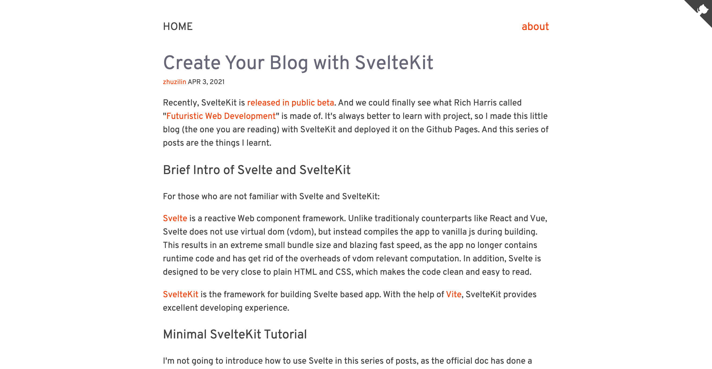

# SvelteKit Blog Demo

As name suggested, this is a demo of a markdown based blog with SvelteKit. And this is also a blog that contains notes on how to create such a blog and deploy to Github Pages.

This blog is hosted on https://svelteland.github.io/svelte-kit-blog-demo/.
